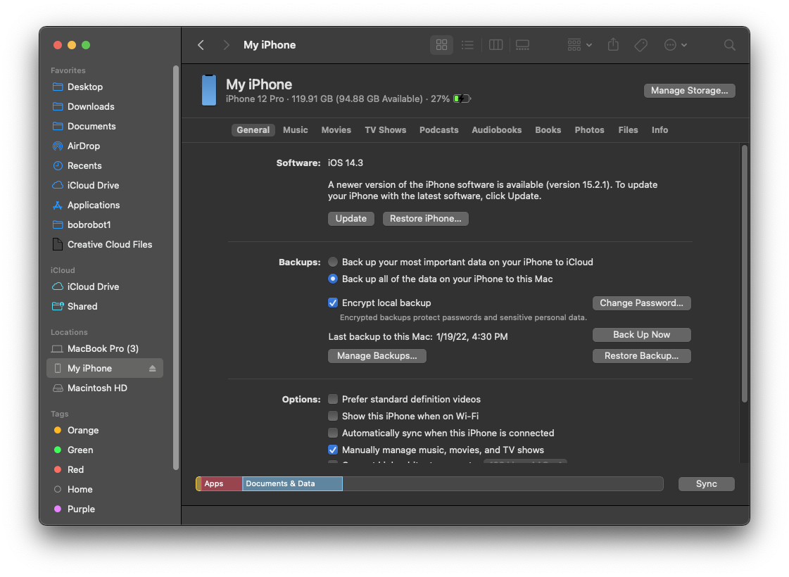
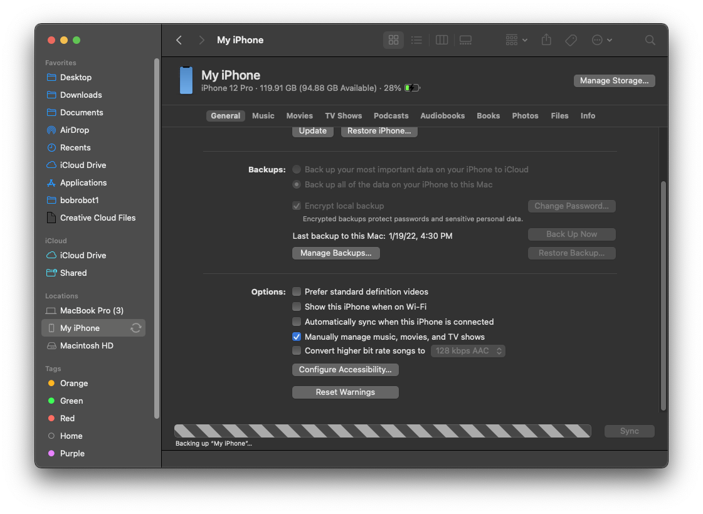
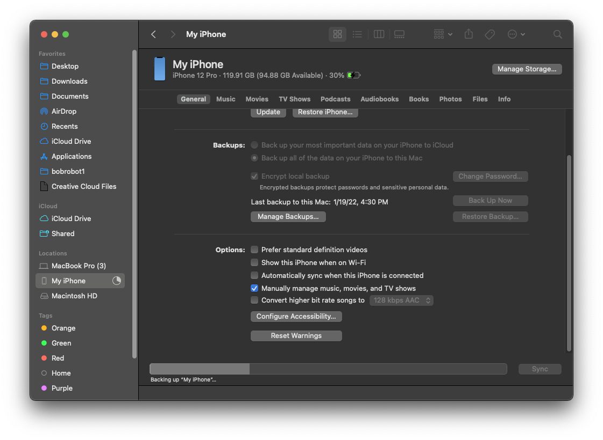
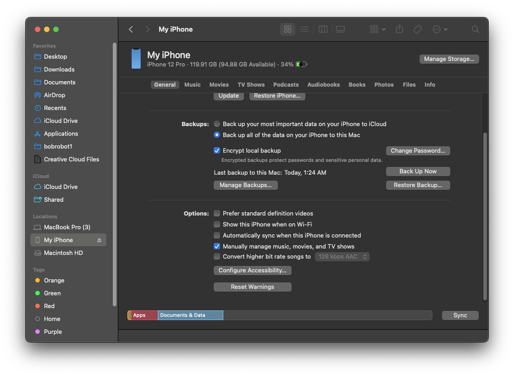

# Backing Up Your iOS Device

To make a backup, connect your iPhone to your Mac.
Then, open Finder on your mac.

__DO NOT UPDATE YOUR PHONE.__

Click on your iPhone in the sidebar, under Locations. 

Set it to "Back up all of the data on your iPhone to this Mac", and then click "Back Up Now".

You may need to make the Finder window bigger if you are not able to see these buttons.

Wait for this progress bar to complete. It will take longer if you have more storage used on your device. 

You will know it has completed when the pie chart on the Finder sidebar turns back into an eject button, and the progress bar turns into your storage file makeup.

You're done. Head back to the [beginning](index.md).