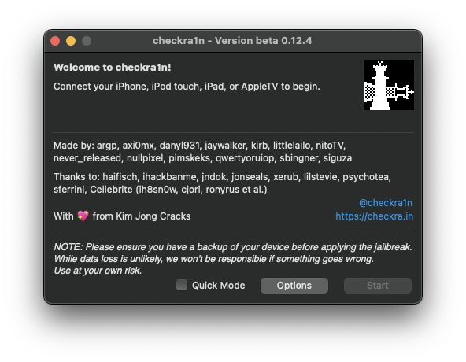
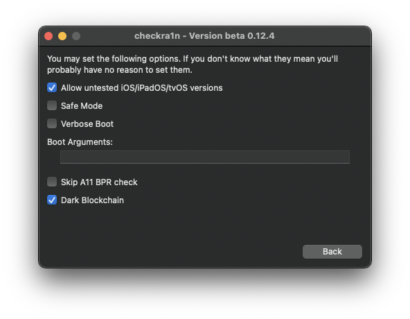
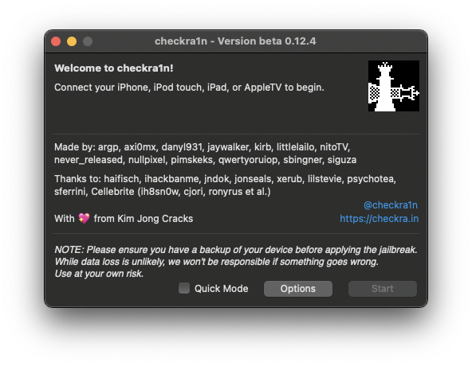
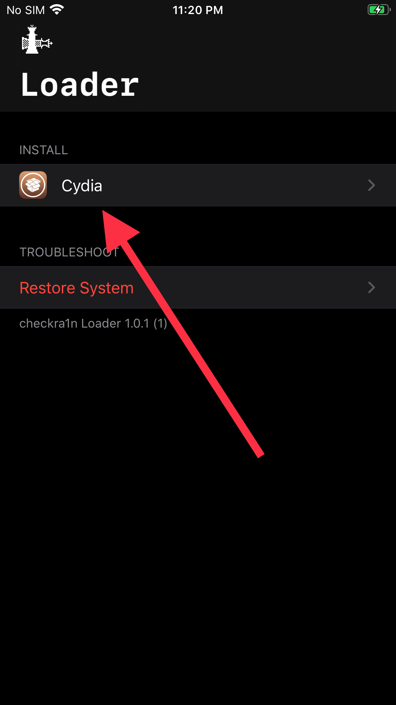

# checkra1n Guide

__**Get a USB Type A (male) to Lightning (male) cable. Type C cables will not work. If you only have Type C ports on your Mac, get a Type C to Type A adapter, and then plug the Type A cable into that. **__

* Ensure it is high quality, and in the best case, ensure it is made by Apple.
* Check the cable for fraying, exposed shielding, or other damage. 
* Checkra1n is both cable-sensitive and device-sensitive, as well as time-sensitive.
* **iPhone X, 8, and 8 Plus need their passcodes removed, and the A11 BPR check skipped. **

Download the latest version from [checkra.in](https://checkra.in/), and open it.

Press "Options"

Enable "Allow Untested iOS/iPadOS/tvOS versions"

**iPhone X, 8, and 8 Plus need their passcodes removed, and the A11 BPR check skipped. **

Press "Back"

Connect your iPhone to the computer, and press "Start".

**It will put your phone into Recovery Mode. This is normal. **

Then, follow the onscreen graphics to put your device into DFU (Direct Firmware Update) mode. This can take a few tries for first-time users. 

You will need to press the indicated buttons in perfect timing with the onscreen timers. These buttons and times vary by device.

Once completed, open the "checkra1n" app that has appeared. Install Cydia with it. 

When you can open Cydia, see the [Cydia guide](cydia.md).
