# Crack & Dump Guide

Ensure Rec Room is deleted.

Go to the App Store.

Give Appstore++ permission to log download info, and tap "Dismiss" on the welcome window. 

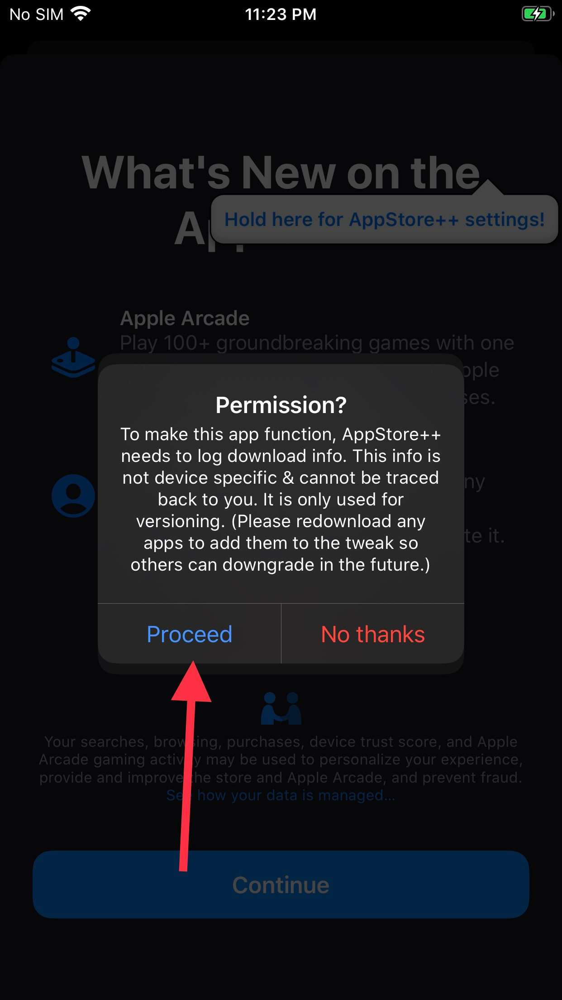

Press and hold your account profile icon.

Activate "Disable App Thinning". Dismiss the warning.

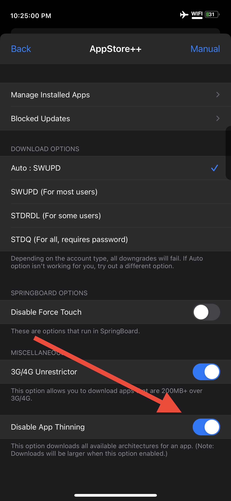

Download and Install Rec Room. After it has finished downloading and installing, go back to the app store home page. 

Press and hold your account profile icon.

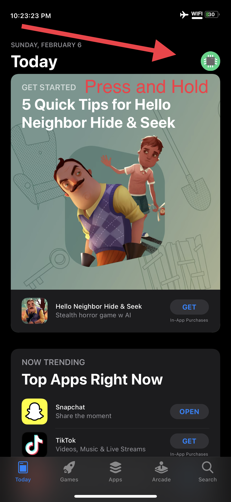

Deactivate "Disable app thinning"

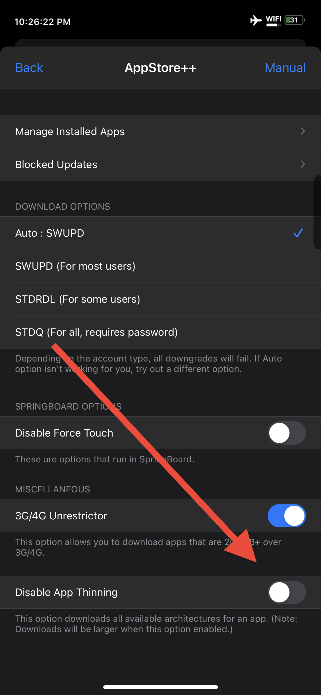

Open Settings

Scroll down to "bfdecrypt"

Press this button.

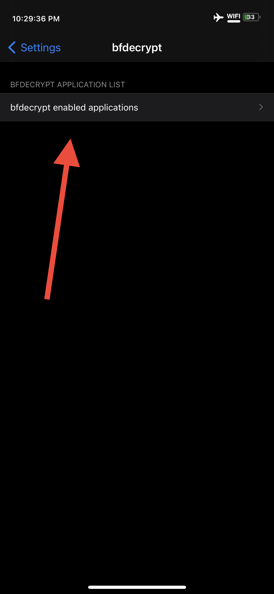

Scroll down to Rec Room, and activate the switch next to it.

Open Rec Room. It will say it's decrypting. This can take 5 minutes or more, depending on your device. 

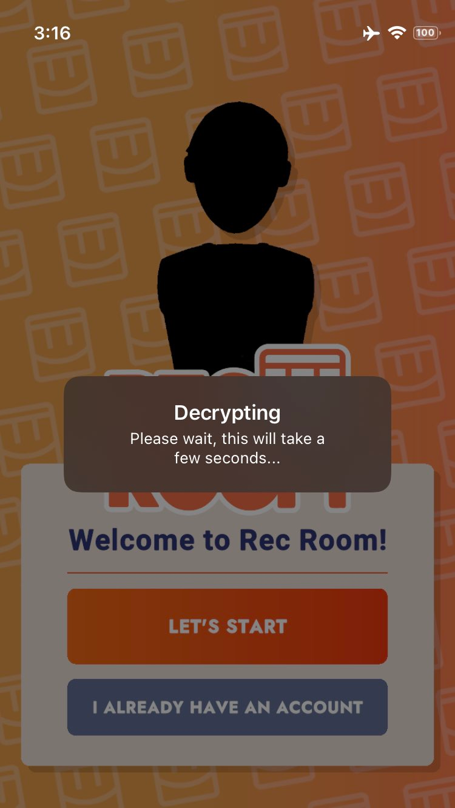

It will ask what you want to do. Click "Show in Filza".

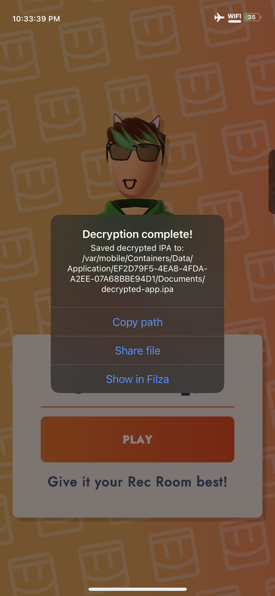

    If you are wondering why I don't instruct you to simply "share file", Filza allows for an easy way to delete the file after transferring if you want. Simply swipe on the file name and a delete button will pop up.

Tap the "i" 

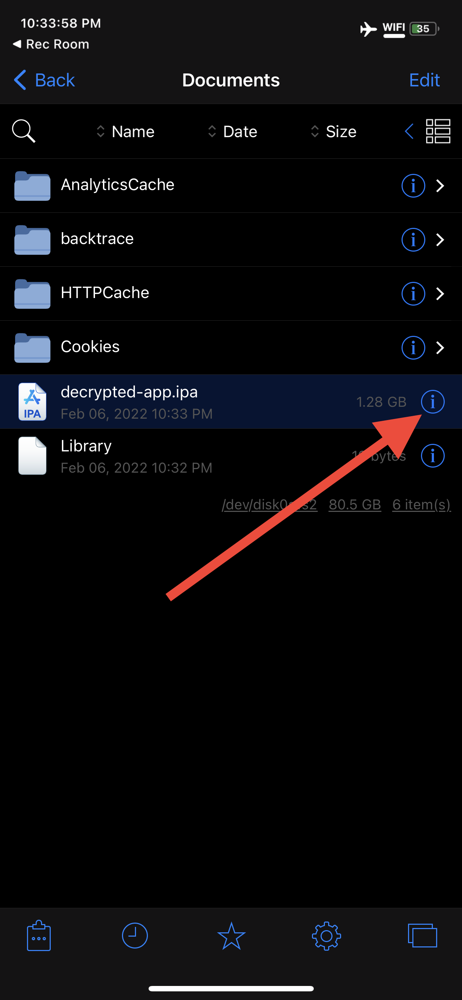

Tap the "Share" icon

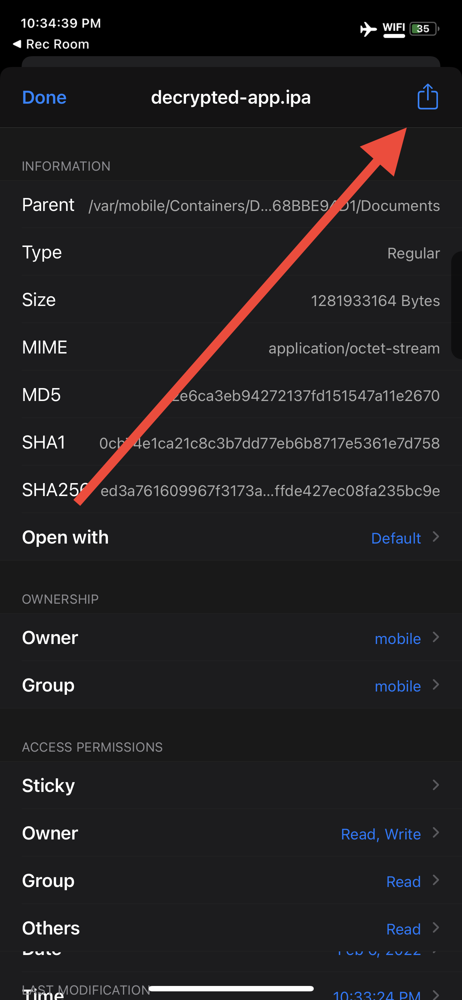

Tap "QuickLook"

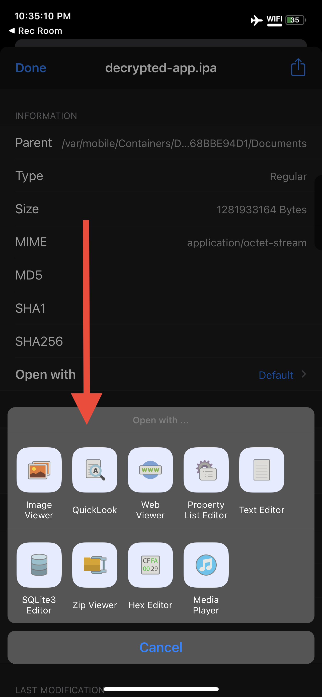

Tap the "Share" icon

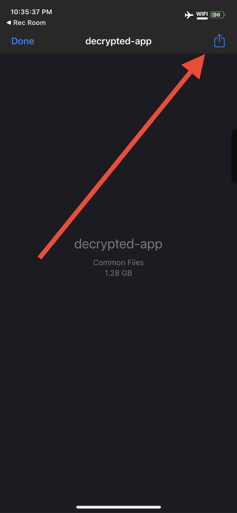

AirDrop it to your Mac.

**Do not share this file with anyone else.**

it's time to [install](install.md). 