# Cydia Guide

Press "Sources" on the bottom.

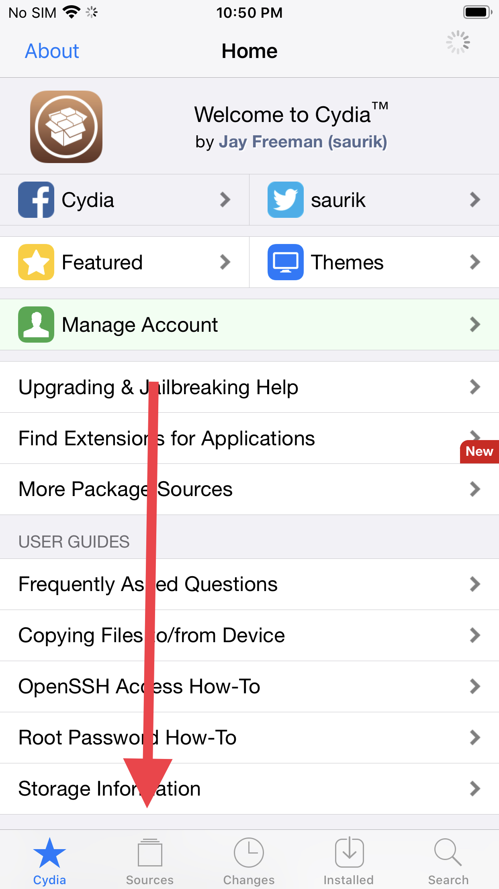

Press "Edit" in the upper right

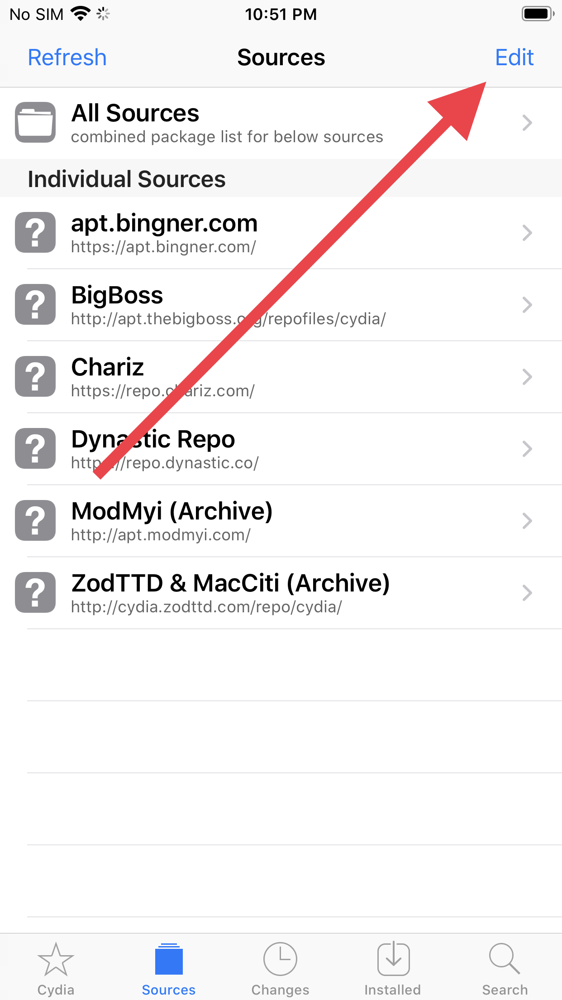

Press "Add" in the upper left

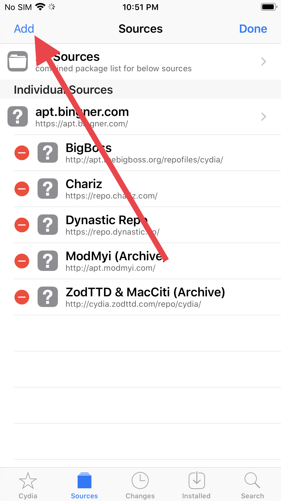

Add the source https://cokepokes.github.io/,

and then add the source https://repo.p0358.net/.

Cydia will validate the URL each time, which will take a minute.

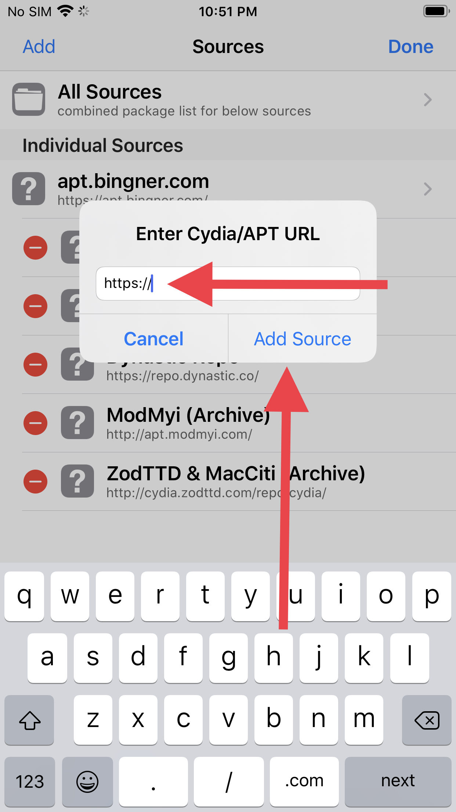

Tap "Search"

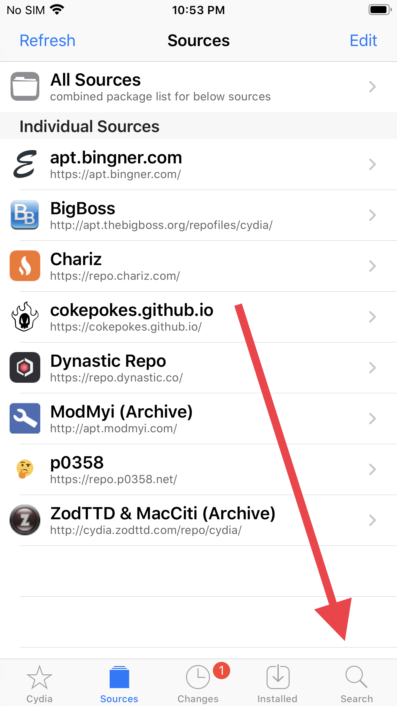

To add a tweak, enter its name, then tap the correct result.

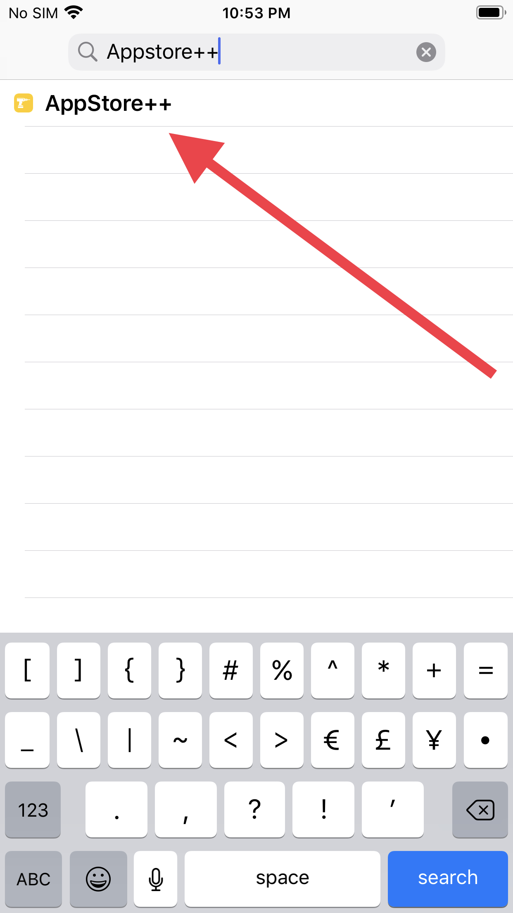

Tap "Modify" on the tweak you are installing.

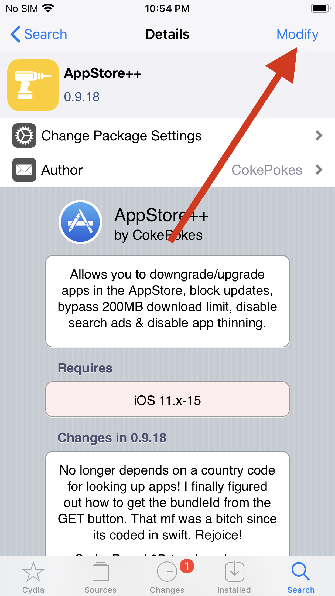

Tap "Install" on the popup menu

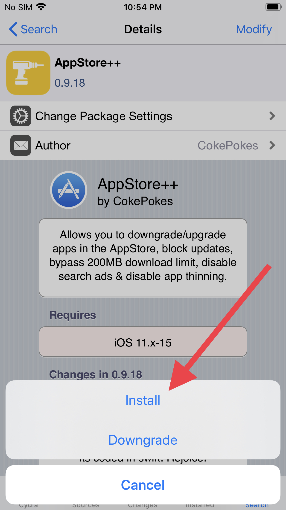

To add more tweaks, tap "Continue Queuing"

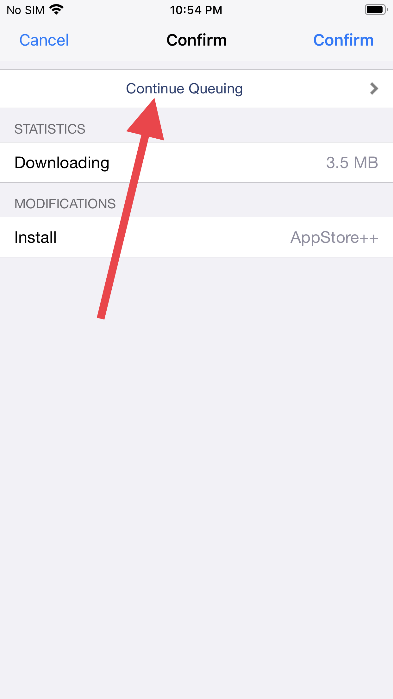

Add the following tweaks to your queue using the steps above:

    Appstore++
    bfdecrypt
    Filza FIle Manager

Then tap "Confirm".

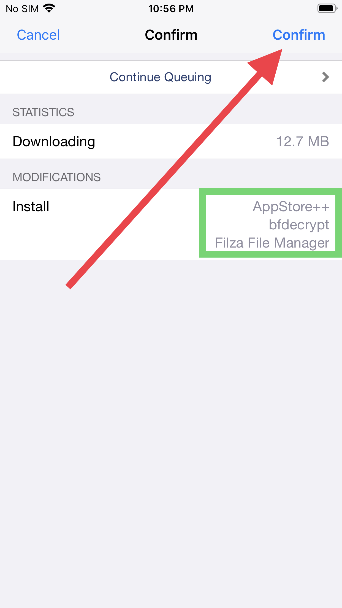

Installation will take more or less time depending on your device model and internet connection. When it is done, Respring your device.

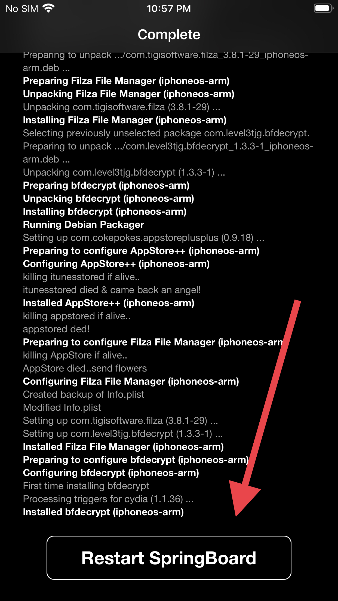

See the [Crack and Dump guide](crack-and-dump.md).