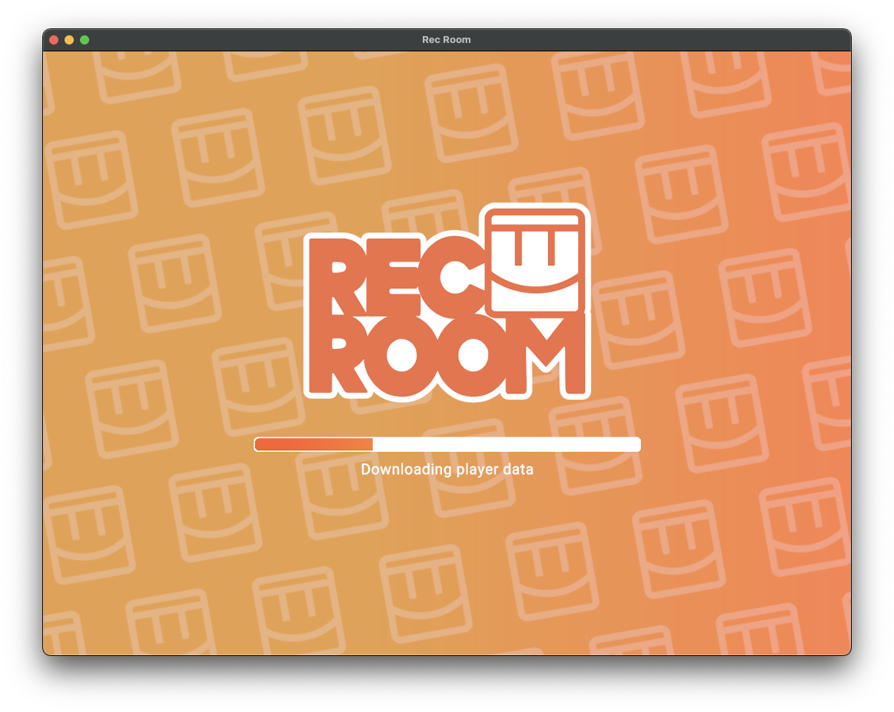
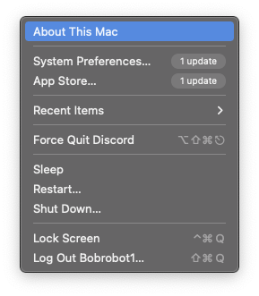
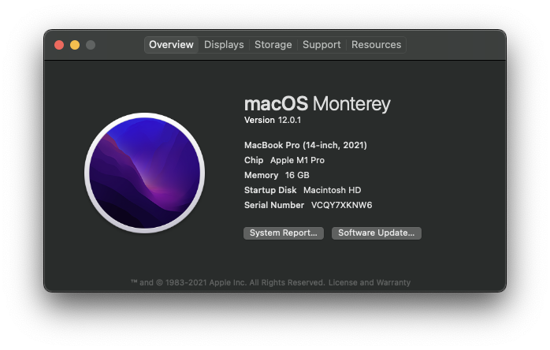
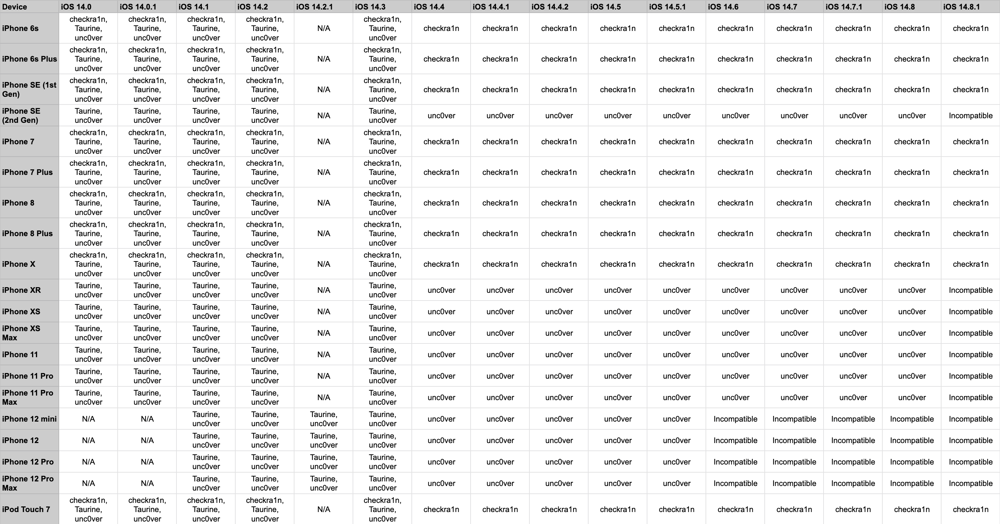

# Introduction

This guide is based off of a guide originally written inside of a Discord server. If you are having any issues, questions, or just want to chat, it's always available. This gude offers no guarentees of any kind, and you follow it at your own risk.

__For troubleshooting, help, or anything else, visit [the Discord](https://discord.gg/Rs94GdFUxm).__

## Warnings before you begin

* If you downloaded a .ipa file from a website, got it from a friend, or otherwise recieved it from any source other than your own device, do not complete this tutorial, and delete the file. Modified .ipa files are dangerous, and hard to detect.
* This tutorial will take over an hour for first-time users. Be aware of your own skill level, and do not rush this tutorial, as you may accidentally miss crucial steps.
* Read the guide in its entirety before beginning, as you should be at least familiar with the process first.

## Getting Started

### Step One: Check for compatible Mac
First, Head to the Apple Logo in the upper left of your Mac, and click "About This Mac" 

* If your Mac has a processor with **Intel** in the name, your device is not compatible with this guide.
* If your Mac has a processor with **Apple** in the name, your Mac is compatible, and you can continue. 

### Step Two: Back up your iOS Device

If you have not backed up your iOS device to your computer recently, follow [this guide](backup.md).

### Step Three: Check for compatible iOS Device

Use the chart below to check for iOS device compatibility.

* If your device is listed as **Incompatible**, your device is incompatible.
* If your device is listed as **unc0ver**, follow [this guide](unc0ver.md).
* If your device is listed as **Taurine**, follow [this guide](taurine.md).
* If your device is listed as **checkra1n**, follow [this guide](checkra1n.md).
* If your device has more than one entry, **Taurine > unc0ver > checkra1n**. Choose accordingly.
* If your device has a version lower than 14.0, use **unc0ver**. If it has a version **newer than 14.8.1**, your device is incompatible.

  
<a href="assets/ioschart.png" target="_blank">Open Image in New Tab</a>
