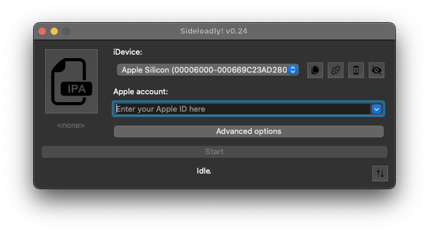
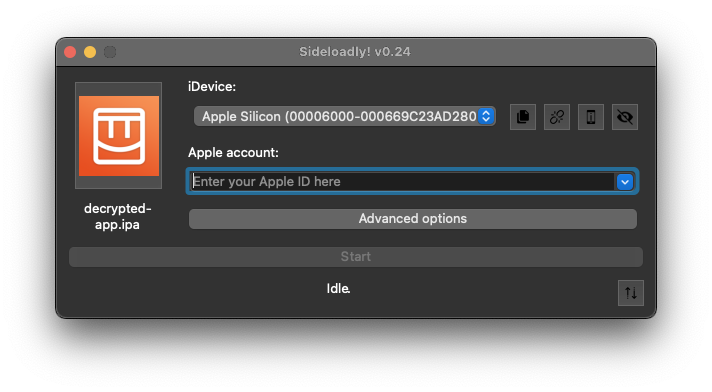
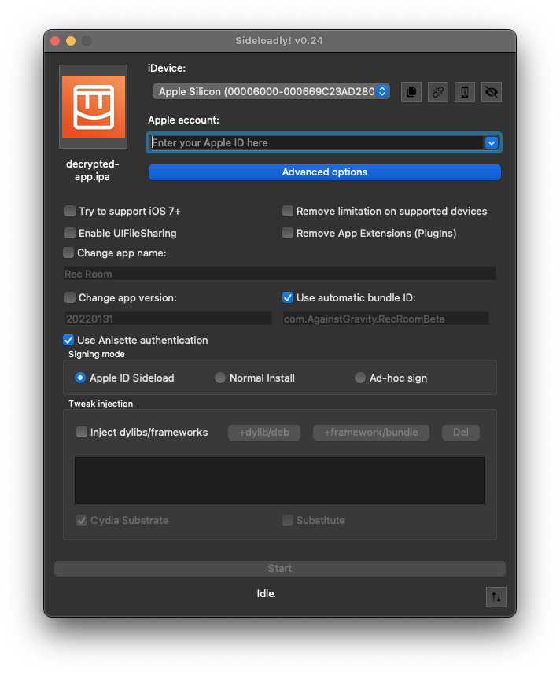

# It's time to install!

Go to [sideloady.io](https://sideloadly.io/) on your Mac, and click "macOS Download"

Install and open it.

Drag the .ipa file you airdropped from your iPhone onto SideLoady.

> __Malware Prevention Alert:__

> If you did not generate this file yourself, as shown in the Crack & Dump guide, do not continue.
Do not install a file you have downloaded from the internet, received from a friend, or gotten anywhere other than your iOS device. 

Open "Advanced options"

Activate "Remove limitation on supported devices"

Enter your Apple ID in the provided field

Enter your account password.

> Entering your Apple ID account password into some app you downloaded off the internet while following a guide is not something I would normally recommend doing, but it is necessary to continue.

If you use 2 factor authentication, you might need to generate an [app-specific password](https://support.apple.com/en-us/HT204397) to use in place of your regular password.

If it fails anyway, try toggling Anisette authentication.

After installation completes, see the [Launch guide](launch.md).