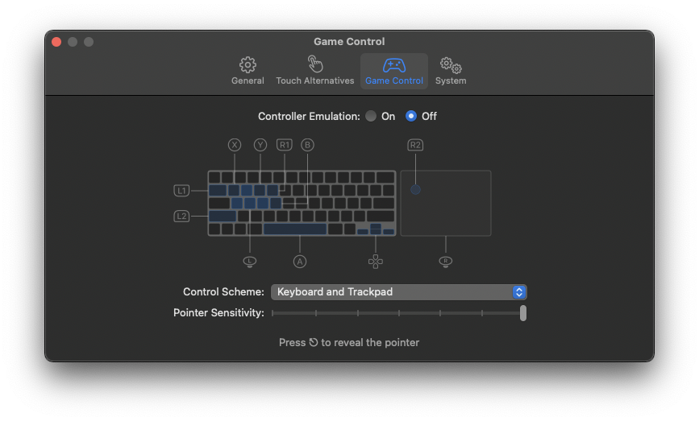

# Launch Guide

Welp, you made it. Congrats. Hope that didn't take you to complete as long as it took me to figure out. 

If you want WASD controls for the game, press Command + comma after opening the app, and turn on Controller Emulation. 

__Move the pointer around interfaces like watches and login screens with WASD__

Welp, you’re done. You have finished the guide. Join the [Discord](https://discord.gg/Rs94GdFUxm)!