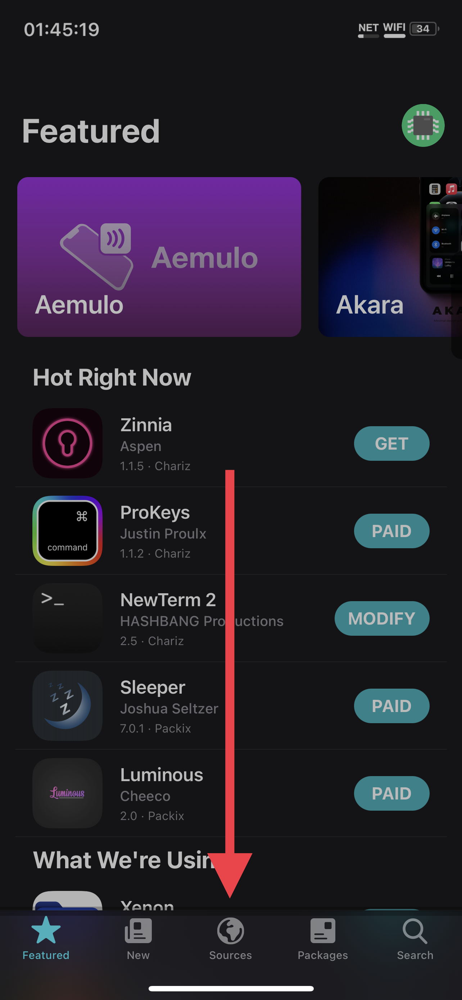
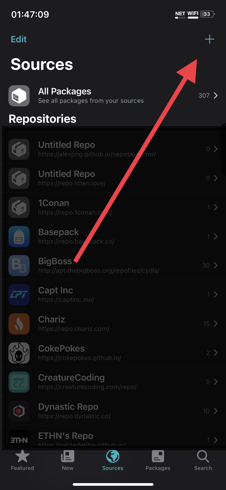
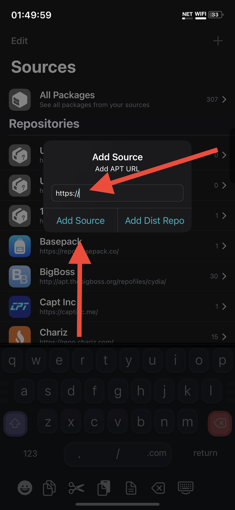
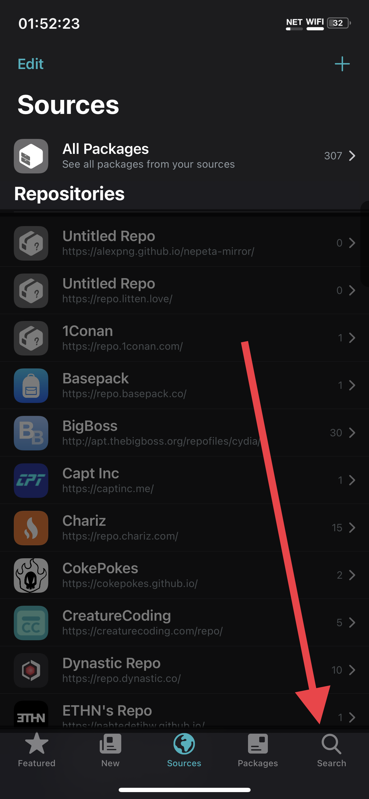
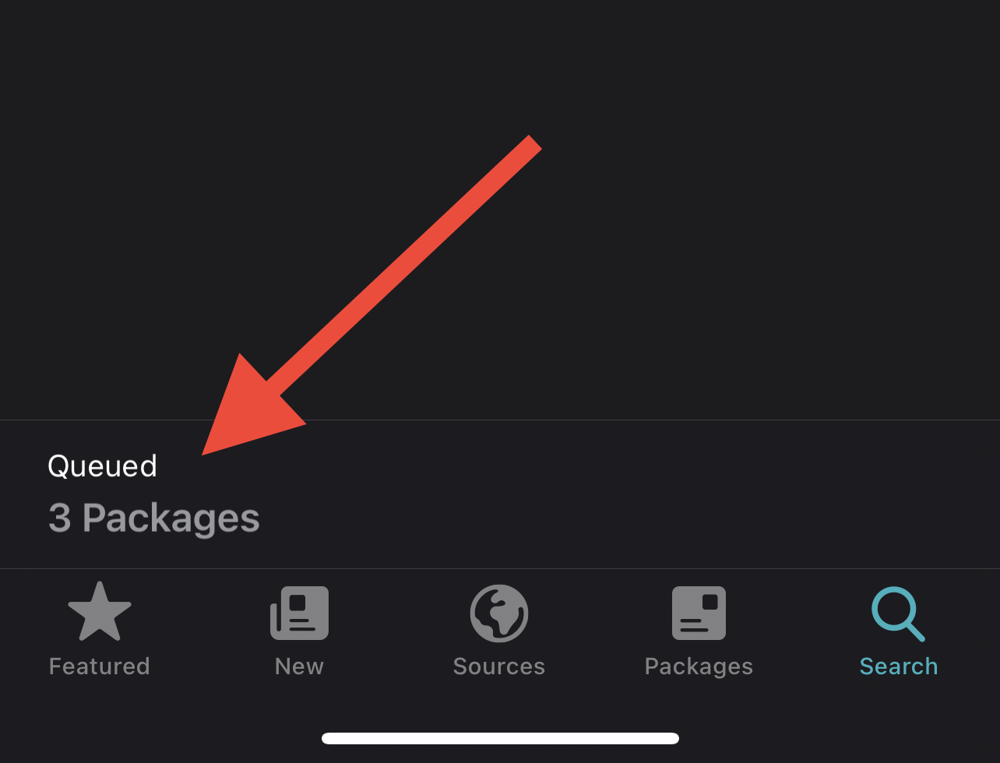
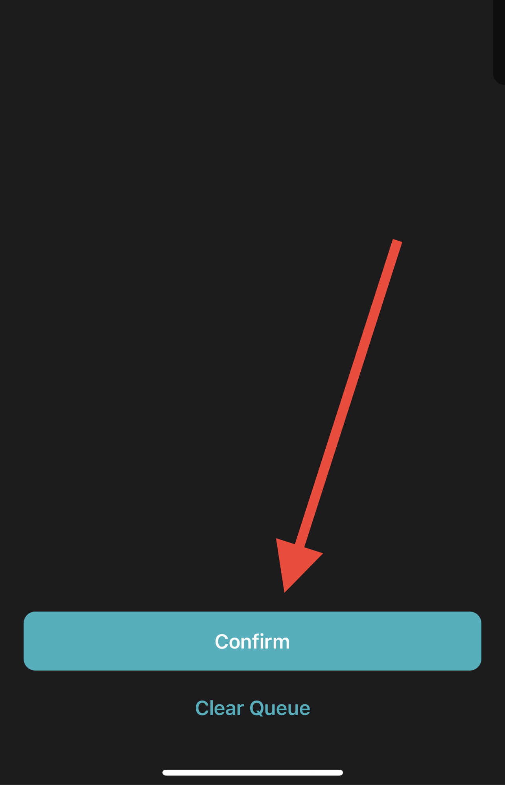
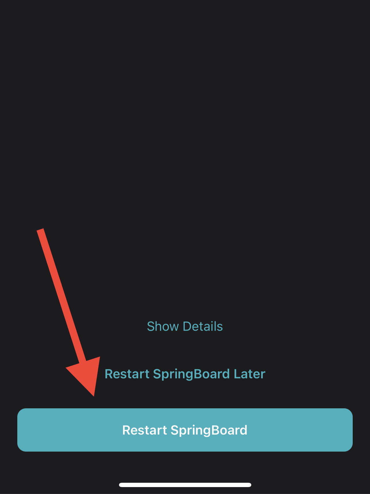

# Sileo Guide

Press "Sources" on the bottom.

Press "+" in the upper right.

    Note that in the screenshot, there are a large number of other repositories. These are not necessary for this tutorial, and I have dimmed them in the screenshot.

Add the source https://cokepokes.github.io/
Add the source https://repo.p0358.net/

Press "Search" on the bottom.

* Search for and queue for install by "AppStore++" by CokePokes, by pressing the "GET" button, which will then say "QUEUE"
* Search for and queue for install by "Filza File Manager" by TIGI Software, by pressing the "GET" button, which will then say "QUEUE"
* Search for and queue for install "bfdecrypt" by level3tjg, by pressing the "GET" button, which will then say "QUEUE"

Tap the queue at the bottom of the screen.

Begin the installation.

Respring your device. Then, see the [Crack and Dump guide](crack-and-dump.md).

