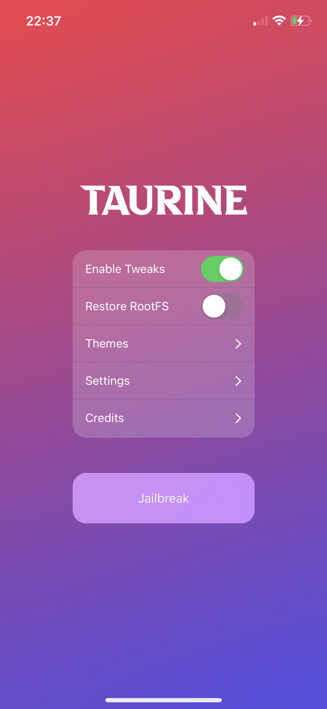
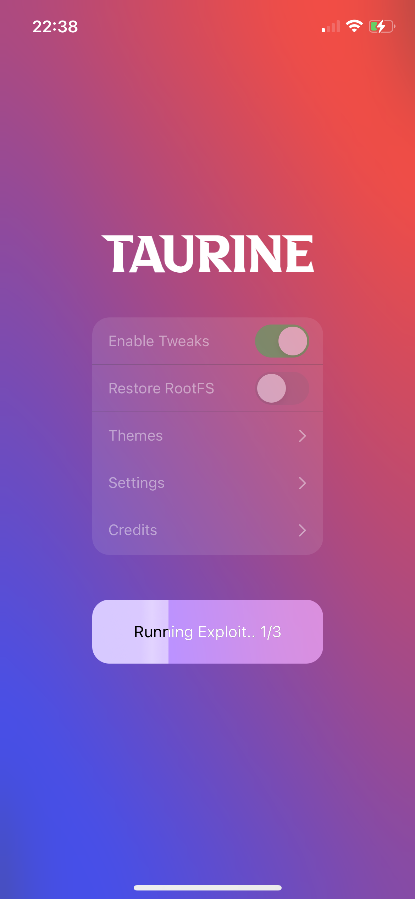
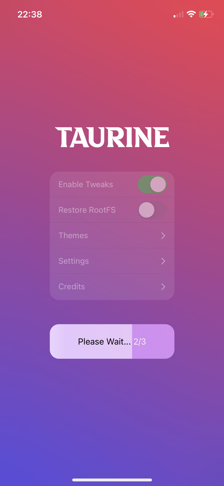

# Taurine Guide

On your Mac device, head to [altstore.io](https://altstore.io), and download the latest version.

Follow the official guide [here](https://faq.altstore.io/getting-started/how-to-install-altstore-macos).

Once you are done, head to [taurine.app](https://taurine.app/#download) on your iPhone, and click "Install via AltStore"

After it installs, open Taurine. Tap "Jailbreak".

Wait for it to jailbreak your device. 

After it has jailbroken your device, it will restart your device. 

It may also ask you to perform the jailbreak again if it fails the first time.

You'll know you're done when you can open the Sileo app. When done, see the [Sileo guide](sileo.md).