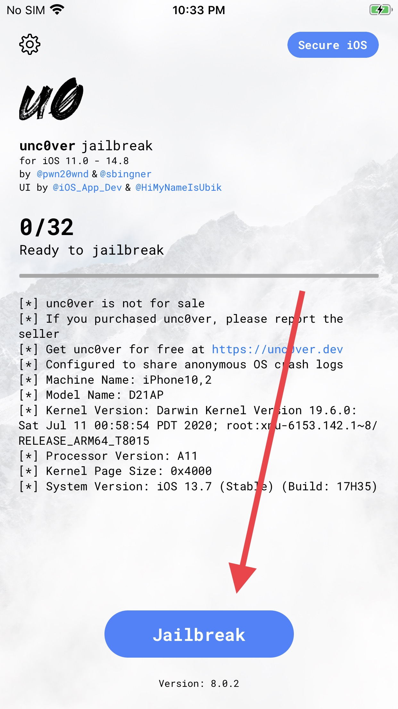

# unc0ver Guide

On your Mac device, head to [altstore.io](https://altstore.io), and download the latest version.

Follow the official guide [here](https://faq.altstore.io/getting-started/how-to-install-altstore-macos).

Once you are done, head to [unc0ver.dev](https://unc0ver.dev/) on your iPhone, and click "Open in AltStore"

After it installs, open unc0ver on your iOS device, and tap "Jailbreak".

It may ask you if you want to share crash logs. Decline.

It may ask you to install Unveil. Press no.

You'll know you're done when you can open the Cydia app on your home screen. See the [Cydia guide](cydia.md) when complete.